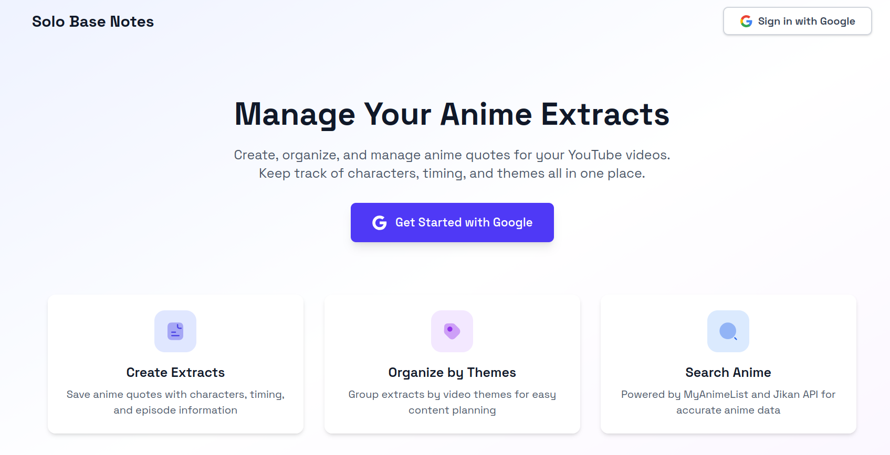

# Solo Base Notes - Frontend


<div align="center">
  

  <p>React frontend application for managing anime extracts for Solo Geek YouTube channel.</p>

  
</div>

## Features

- Google OAuth authentication
- Anime search and character browsing (MyAnimeList & Jikan)
- Extract creation and management
- **Subtitle auto-fill with automatic text extraction**
- **AI-powered text correction and spell checking**
- **Subtitle formatting tag removal (clean text)**
- **Real-time text sync with timing adjustments**
- Theme-based organization with visual categories
- Video builder with extract segments
- Spotify music integration for videos
- YouTube channel integration
- Published video linking to extracts
- Extract usage tracking
- Responsive design with Tailwind CSS

## Tech Stack

- React 19
- TypeScript
- Vite (build tool)
- React Router 7
- Apollo Client (GraphQL)
- Tailwind CSS 4
- Iconsax React (icons)

## Getting Started

### Prerequisites

- Node.js (v18+)
- Backend server running (see server/README.md)

### Installation

1. Install dependencies:
```bash
npm install
```

2. Create `.env` file:
```bash
VITE_GRAPHQL_URL=http://localhost:4000/graphql
```

### Run the Application

Development mode:
```bash
npm run dev
```

Build for production:
```bash
npm run build
```

Preview production build:
```bash
npm run preview
```

The application will start at `http://localhost:5173`

## Project Structure

```
client/
├── src/
│   ├── app.layout.tsx              # Root layout component
│   ├── main.tsx                    # Application entry point
│   ├── components/
│   │   ├── actions/                # Button components
│   │   ├── forms/                  # Form components
│   │   ├── layout/                 # Layout components (header, sidebar)
│   │   ├── modals/                 # Modal components
│   │   └── ProtectedRoute.tsx     # Auth route guard
│   ├── context/
│   │   ├── auth-context.tsx       # Authentication state
│   │   └── toast-context.tsx      # Toast notifications
│   ├── hooks/
│   │   └── useAuth.ts             # Auth hook
│   ├── lib/
│   │   ├── apollo-client.ts       # Apollo Client setup
│   │   ├── utils/
│   │   │   └── subtitleUtils.ts   # Subtitle text processing
│   │   └── graphql/
│   │       ├── queries.ts         # GraphQL queries
│   │       └── mutations.ts       # GraphQL mutations
│   ├── pages/
│   │   ├── index.tsx              # Router configuration
│   │   ├── landing/               # Landing page
│   │   ├── auth/                  # OAuth callback
│   │   └── dashboard/
│   │       ├── home.tsx           # Dashboard home
│   │       ├── extracts/          # Extract pages
│   │       ├── themes/            # Theme pages
│   │       ├── videos/            # Video pages
│   │       ├── video/             # Video builder
│   │       └── published-videos/  # YouTube video linking
│   └── types/                     # TypeScript types
├── index.html
├── vite.config.ts
├── tailwind.config.ts
└── package.json
```

## Key Features

### Extract Management
- Create extracts with anime metadata, characters, timing, and episode info
- **Auto-fill extract text from OpenSubtitles**
  - Language selection (English/French)
  - ID mapping service selection (ARM/ids.moe)
  - Automatic text extraction based on timing
  - Real-time text updates when timing changes
- **AI-powered spelling correction with Gemini**
- **Clean subtitle formatting tags** ({\i1}, {\i0}, etc.)
- Organize extracts by custom themes with colors
- Filter extracts by theme or anime
- Visual indicators for extracts already used in videos

### Theme System
- Create custom themes with names, descriptions, and colors
- View extract count per theme
- Color-coded badges throughout the app

### Video Builder
- Create videos by selecting multiple extracts
- Reorder segments with drag-and-drop
- Add Spotify music tracks
- Visual representation with anime-specific colors
- Preview segment details (anime, episode, timing, characters)

### Published Video Linking
- Browse YouTube channel videos
- Link existing published videos to extracts
- Track which extracts are used in published videos
- Update and manage extract associations
- Filter out YouTube Shorts (≤60s videos)

### Extract Usage Tracking
- Visual indicators show when extracts are used in videos
- Prevents reuse of extracts across multiple videos
- Automatic release of extracts when videos are deleted
- Works for both internal videos and published YouTube videos

## Authentication

The app uses Google OAuth for authentication. Users must sign in to access the dashboard and manage extracts.

- Login page: `/`
- OAuth callback: `/auth/callback`
- Protected routes: `/dashboard/*`

## GraphQL Integration

All data fetching and mutations use Apollo Client with automatic JWT token injection from localStorage.

### Main Queries
- `GET_EXTRACTS` - Fetch all extracts with optional filters
- `GET_THEMES` - Fetch all themes with extract counts
- `GET_VIDEOS` - Fetch all videos
- `GET_PUBLISHED_VIDEOS` - Fetch YouTube video links
- `SEARCH_ANIME` - Search anime by title
- `GET_ANIME_CHARACTERS` - Get characters for an anime
- `SEARCH_SPOTIFY_TRACKS` - Search music tracks
- `SEARCH_SUBTITLES` - Search subtitles by anime/episode
- `DOWNLOAD_SUBTITLE` - Download and parse full subtitle file

### Main Mutations
- `CREATE_EXTRACT` - Create new extract
- `UPDATE_EXTRACT` - Update existing extract
- `DELETE_EXTRACT` - Delete extract
- `CREATE_THEME` - Create new theme
- `CREATE_VIDEO` - Create video from extracts
- `PUBLISH_VIDEO` - Mark video as published with YouTube ID
- `LINK_PUBLISHED_VIDEO` - Link YouTube video to extracts
- `CORRECT_SPELLING` - AI-powered text correction

## Styling

The app uses Tailwind CSS 4 with a custom color scheme:
- Primary: Indigo (`#4F46E5`)
- Secondary: Purple (`#7C3AED`)
- Accent colors for different UI elements
- Responsive design with mobile-first approach

## License

MIT
